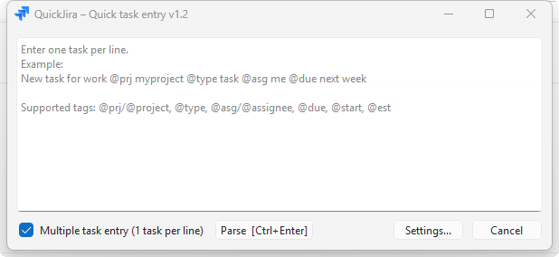
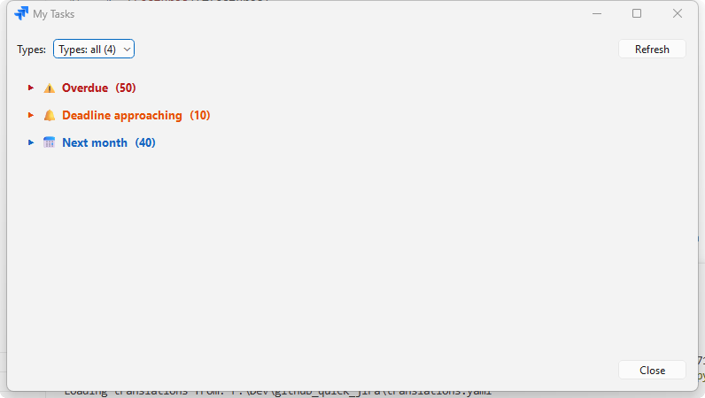

# QuickJira

**QuickJira** is a lightweight Windows system-tray app for creating Jira issues at lightning speed.
Type one task per line (or a multi-line single task), attach inline tags, review the parsed result, and bulk-create everything in Jira - without ever opening a browser.




The idea for quickly entering tasks was suggested by an application [MyLifeOrganized](https://www.mylifeorganized.net/)  that has the [Rapid Task Entry](https://www.mylifeorganized.net/support/quick-input/) function.

It is also possible to view tasks for the nearest future that have a deadline for completion.




---

## Table of contents

1. [Features](#features)
2. [Quick start (run from source)](#quick-start-run-from-source)
3. [Build a standalone Windows .exe](#build-a-standalone-windows-exe)
4. [Input syntax & tags](#input-syntax--tags)
5. [Settings reference](#settings-reference)
6. [How to get a Jira API token](#how-to-get-a-jira-api-token)
7. [File locations (config & cache)](#file-locations-config--cache)
8. [Supported languages](#supported-languages)
9. [Contributing](#contributing)

---

## Features

- **System-tray app** — runs silently in the background; open with a global hotkey or a tray-icon click.
- **Fast multi-task entry** — type several tasks at once, one per line.
- **Single-task rich mode** — switch to a free-form multi-line input where the first line is the summary and the rest becomes the description (newlines preserved in Jira).
- **Inline tags** — `@prj`, `@type`, `@asg`, `@due`, `@start`, `@est`, `@label`, `@status` directly in the text.
- **Fuzzy matching** — project keys/names and issue types are matched with fuzzy logic; you don't need to type exact names.
- **Natural-language dates** — `@due next week`, `@due friday`, `@due 15 december 2026` all work. Same for `@start`.
- **Auto start-date calculation** — if `@est` is set and `@due` is known, `@start` is computed automatically as due minus estimate (with a buffer); and vice-versa.
- **Review & edit** — parsed tasks open in an editable table before anything is sent to Jira. Each row has date pickers for due and start dates.
- **Autocomplete** — tag names, project keys, issue types, assignees, labels and statuses are all suggested as you type.
- **My Tasks board** — view your open Jira tasks grouped by urgency (overdue / approaching / next month) directly from the tray. Categories are collapsible with a single click.
- **Deadline notifications** — the app checks for overdue and approaching tasks hourly and shows a tray notification when the set changes.
- **Global hotkeys** — configurable keyboard shortcuts to open the Input window (default: **Alt+Shift+M**) and the My Tasks board (default: **Alt+Shift+T**).
- **Multilingual UI** — English, Russian, Lithuanian, Polish, Latvian built-in; add more in `translations.yaml`.
- **Windows autostart** — optional registry entry so the tray app starts with Windows.

---

## Quick start (run from source)

### Prerequisites

- Python **3.10** or newer
- A Jira Cloud instance you can reach over HTTPS

### Installation

```bash
git clone https://github.com/naydinav/quick_jira.git
cd quick_jira

# Create a virtual environment (recommended)
python -m venv .venv
.venv\Scripts\activate          # Windows
# source .venv/bin/activate     # macOS / Linux

pip install -r requirements.txt
```

### Run

```bash
python quick_jira.py
```

The app appears in the system tray.
On the **first run** the Settings dialog opens automatically so you can fill in your Jira credentials.

---

## Build a standalone Windows .exe

The app ships as a single Python file, so PyInstaller bundles it into one portable executable with no Python installation required on the target machine.

```bash
pip install pyinstaller

pyinstaller --noconsole --onefile quick_jira.py
```

The executable is placed in `dist\quick_jira_v2.exe`.
Copy it anywhere — it carries the icon and all UI strings internally.

## Installation

The app does not require installation. Copy the executable file and `translations.yaml` to the desired directory and run it.

---

## Input syntax & tags

### Multi-task mode (default)

Each **non-empty line** is one independent Jira issue.
Use a period (`.`) inside the line to split summary from description:

```
Fix login crash. Steps: open app, wait 30 s, tap Login  @prj MOBILE @type Bug @asg me @due friday
Add dark mode @prj WEB @type Story @est 4h @label ui; design @status In Progress
Send weekly digest @prj OPS @type Task @asg john.doe @due next week @start monday
```

### Single-task mode

Uncheck **"Multiple task entry"** in the input window.
The entire text block is treated as **one issue**:

- **First non-empty line** → summary
- **All remaining lines** → description (line-breaks preserved in Jira)
- Tags can appear **anywhere** in the text

```
Fix crash on login
  Steps to reproduce:
  1. Open the app and wait 30 minutes
  2. Tap "Log in"
  @prj MOBILE @type Bug @asg me @due next week @est 2d
```

### Tag reference

| Tag | Description |
|---|---|
| `@prj` / `@project` | Jira project key or name (fuzzy-matched) |
| `@type` / `@issue` | Issue type, e.g. `Bug`, `Story`, `Task`, `Epic` (fuzzy-matched) |
| `@asg` / `@assignee` | Assignee: use `me` for yourself, or a display name / email |
| `@due` | Due date — ISO (`2026-12-31`), weekday (`friday`), or natural language (`next week`) |
| `@start` / `@begin` | Start date — same date formats as `@due`; auto-calculated from `@due` + `@est` when omitted |
| `@est` / `@estimate` | Time estimate — `30m`, `2h`, `1d`, `1w 2d` |
| `@label` / `@labels` / `@lbl` | Semicolon-separated labels, e.g. `ui; backend` |
| `@status` | Transition the issue to this status immediately after creation |

> Tags and their aliases are fully configurable in `translations.yaml`.

> `@start` is only available when the **Start Date field** is configured in Settings (Task settings tab). The field ID must match the custom field in your Jira instance (e.g. `customfield_11011`).

---

## Settings reference

Open Settings from the tray icon → **Settings…** or the button in the main window.

### Task settings tab

| Field | Description |
|---|---|
| **Jira URL** | Base URL of your Jira instance, e.g. `https://mycompany.atlassian.net` |
| **User (email/login)** | Your Atlassian account email (Cloud) or username (Server) |
| **API Token** | Personal API token — see [How to get a Jira API token](#how-to-get-a-jira-api-token) |
| **Check connection** | Verifies credentials, shows your display name, and checks Start Date field availability |
| **Default project** | Project key used when `@prj` is omitted |
| **Default issue type** | Issue type used when `@type` is omitted (default: `Task`) |
| **Default assignee** | Assignee used when `@asg` is omitted; `me` = yourself |
| **Default workdays (@due)** | Business days added to today when `@due` is omitted (0 = no due date) |
| **Default estimate** | Estimate used when `@est` is omitted, e.g. `1h` |
| **Start Date field** | Jira custom field ID for start date, e.g. `customfield_11011`. Leave empty to disable `@start` everywhere |
| **Default labels** | Semicolon-separated labels applied to every new issue |
| **Default status** | Status to transition every new issue into after creation |

### Application settings tab

| Field | Description |
|---|---|
| **Language** | UI language (`en` / `ru` / `lt` / `pl` / `lv`; more can be added in `translations.yaml`) |
| **Stay on top** | Keep the input window above all other windows |
| **Inactivity transparency** | Opacity % when the window loses focus (only when Stay on top is on) |
| **Global hotkey** | Enable/disable + configure the shortcut to open the Input window (default: **Alt+Shift+M**) |
| **My Tasks hotkey** | Enable/disable + configure the shortcut to open My Tasks (default: **Alt+Shift+T**) |
| **Run at Windows startup** | Add/remove the app from `HKCU\...\Run` registry key |

---

## My Tasks board

Open from the tray menu → **My Tasks…** or with the **Alt+Shift+T** hotkey.

The board shows all Jira issues assigned to you that are not Done, grouped into three urgency buckets:

| Group | Criteria |
|---|---|
| **Overdue** | Due date is today or in the past |
| **Approaching** | Due within the next 7 days |
| **Next month** | Due within the next 30 days |

- Click a **group header** to collapse or expand its tasks.
- Click an **issue key** to open the issue in your browser.
- Use the **Types** dropdown to filter by issue type (selection is saved).
- Hit **Refresh** to reload from Jira.

---

## How to get a Jira API token

1. Go to <https://id.atlassian.com/manage-profile/security/api-tokens>
2. Click **Create API token**, give it a label (e.g. *QuickJira*), click **Create**.
3. Copy the token — it is shown only once.
4. In QuickJira Settings: **User** = your Atlassian account email, **API Token** = the token you just copied.

---

## File locations (config & cache)

| File | Location | Contents |
|---|---|---|
| `config.json` | `%APPDATA%\QuickJira\config.json` | All settings (URL, credentials, defaults) |
| `cache.json` | `%LOCALAPPDATA%\QuickJira\Cache\cache.json` | Project list, issue types, labels, user cache, MRU projects |
| `translations.yaml` | Same folder as the exe / script | UI strings and tag definitions for all languages |

> **Credentials are stored in plain text** in `config.json`.
> Keep the file private — do not commit it to version control.

To reset the app to factory defaults, delete both JSON files and restart.

To add or customise translations, edit `translations.yaml` — the app merges it with built-in defaults on every start.

---

## Supported languages

| Code | Language |
|---|---|
| `en` | English |
| `ru` | Russian / Русский |
| `lt` | Lithuanian / Lietuvių |
| `pl` | Polish / Polski |
| `lv` | Latvian / Latviešu |

To add a new language:

1. Open `translations.yaml`.
2. Duplicate the `ru:` block under `translations:` and `tags:`.
3. Change the key to your language code (e.g. `de`) and translate the strings.
4. Add the code to the `languages:` list at the top.
5. Restart QuickJira and select the language in Settings → Language.

---

## Contributing

Contributions are welcome!

```
quick_jira.py   ← single-file application (current version)
translations.yaml  ← all UI strings and tag aliases
requirements.txt   ← pip dependencies
```

### Dependencies

| Package | Purpose |
|---|---|
| `PySide6` | Qt6 UI framework |
| `jira` | Jira REST API client |
| `dateparser` | Natural-language date parsing |
| `rapidfuzz` | Fuzzy matching for project / issue-type names |
| `appdirs` | Platform-correct config / cache directories |
| `pyyaml` | Loading `translations.yaml` |
